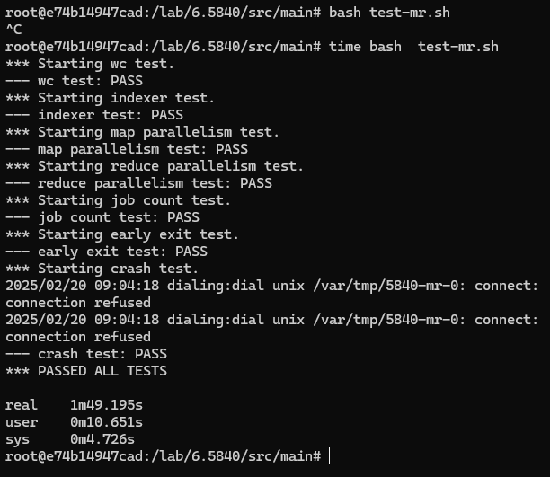

# **MapReduce核心思路**

## 首先需要清楚整个MapReduce的流程：

- Worker需从Coordinator中获取原始数据用于进行MapTask
- Worker将MapTask处理好的数据发送给Coordinate，Coordinator将处理好的数据进行partition处理
- 等待前面所有的MapTask完成之后,Work可再次向Coordinator获取partition之后的分片数据
- Work获取分片数据后再进行ReduceTask，并将ReduceTask的结果输出到mr-out-X文件中

## 其次需要明白框架需求：

1. ##### Work从Coordinator中获取数据（有俩种可能方式，**选择一种实现**）

  - Coordinator主动分发数据

  - Work向Coordinator中抢数据

2. ##### Coordinator要记录Work对Task的执行状态（有俩处需要关注，**都要实现**）

  - Work对原始数据进行MapTask的处理状态 需要关注

  - Work对分片后数据进行ReduceTask的处理状态 需要关注

3. ##### Coordinator对于Work处理失败的数据如何恢复
4. ##### Coordinator如何保证Work不会获得重复的数据，并且不会返回多个相同的值
5. ##### Work执行ReduceTask如何保证在所有MapTask任务完成之后
6. ##### Work进行ReduceTask任务之后要保证输出的mr-out-X文件要根据获取的分片数据确定序号

## 最后进行需求设计：

### 获取数据

对于Work获取原始数据 使用多个Work向Coordinate中抢数据 ，核心使用channel实现。

```go
//当Coordinator启动时将所有的file放入Channel中
	for _,file =range(files){
		channel <-file
        statusMap.stroe(file,0)
	}
//此时channel中就存有所有的file


//当其它Work通过rpc调用 Coordinator的分配数据时 只需往channel中得到一个数据即可
	data:= <-channel
//这样写优点是可以不用手动处理多线程获取重复数据的问题，因为channel中数据只有一份
```

### 记录状态及恢复

记录状态我打算使用ctx作为一个定时器，sync.Map用作记录状态

```go
//用俩个数组分别记录数据的执行状态   0代表未执行，1代表执行中，2代表已成功处理
statusMap=sync.Map{}


//超时时间定位五秒，当五秒之后Work端还没发送已完成命令就将 从channel中取出来的数据重新放回去
when 获取数据:
	data:=<-channel
    if(statusMap.load(data)==0){
        statusMap.stroe(data,1)
        ctx,cancel:=context.WithTimeout(context.Background(),time.Second*5)
        statusMap
        select {
        case <-ctx.Done():
            //如果超超时了将当初那个数据放回channel中
           if ctx.Err() == context.DeadlineExceeded {
               channel<-data
               statusMap.stroe(data,0)
           }else{
               //如果Work处理成功了 就会调用cancel()方法 代表成功了 就可以改变数据状态了 
			   statusMap.stroe(data,2)
           }
        }
    }
	
```

## 补充细节后结果


