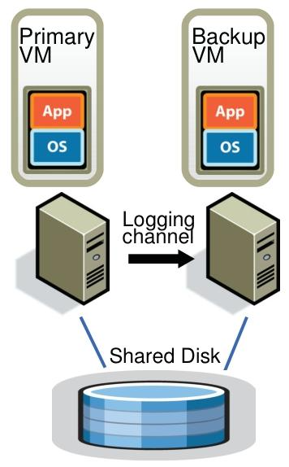
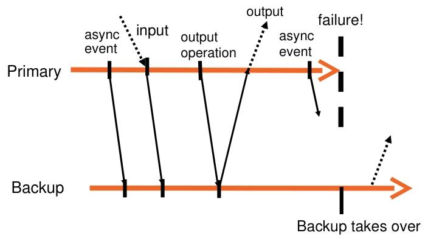

# 名词解释：

| 缩写 |      英文       |   中文   |
| :--: | :-------------: | :------: |
|  FT  | Fault Tolerance | 故障容错 |

- **Q：**主从模式下如何保证**数据的最终一致性**？

  **A：**主从服务器通过**日志通道**分享日志信息，主服务器将输入和操作记录写入日志文件，备份服务器从日志通道读取日志然后在自己服务器上重现主服务器的操作。对于非确定性操作（如读取时钟周期计数器）和事件（如定时器中断），会记录足够信息以便在在从服务器上重现相同的状态变化和输出。

  优点：可以节省i/o开支

  

  

- **Q：**主从模式如何保证当主服务器挂掉之后从服务器能**顺利接管工作**？

  **A：**首先主从模式的切换对于用户来说是感受不到的，为了保证数据一致性从服务器的输出会被丢弃，其次只有当**从服务器确认接收到了日志文件主服务器才会将运行结果进行输出**。

- **Q：**当主从之间因为**网络问题**导致两者之间断开链接如何**防止脑裂**？

​	**A：**主从服务器之间使**用UDP心跳检测（双向）和监控日志流量**的方式判断是否会导致脑裂的发生。当脑裂发生后系统会采用**共享内存**的方式解决问题。具体为在共享存储上**执行一个原子测试和设置操作**（atomic test-and-set operation）。若操作成功，该虚拟机才被允许启动接管；若操作失败，说明另一个虚拟机已成功启动接管，当前虚拟机则会自行停止（“commits suicide”）。如果虚拟机在执行原子操作时无法访问共享存储，会等待直至可以访问。由于虚拟磁盘存储在共享存储上，若共享存储因存储网络故障不可访问，虚拟机也难以开展有效工作，所以这种方式不会额外增加系统不可用性。

​	**注：**原子测试和设置操作是**不可分割**的，实现原理为俩台服务器会对共享内存上**同一个标记位**进行修改 如果标记位不存在则将其修改为自己（由于此操作是原子性的因此不会被抢占），若存在则表明另一台服务器正在对外展示，此时未抢占超过的服务器停止自身服务。
​	**注：**UDP首先是双向监测，其次若监控断开并不会立马报警，而是有一个缓存时间。

- **Q：**当备用服务器挂掉之后怎么办？

   **A：**VMware vSphere实现了一个集群服务，用于维护管理和资源信息，当一个备份服务器挂掉之后，主VM会通知集群服务它需要一个新的备份。 集群服务根据资源使用情况和其他约束来确定运行备份VM的最佳服务器，此备份服务器通过FT 的 VMonition技术克隆一个备份服务器，然后后续再使用日志重放来保证主从一致。
   
   

-   **Q：**如果主节点在刚刚收到备份节点的确认之后，但在发出输出之前崩溃了怎么办？这是否意味着输出永远不会生成？

​	 **A：**备份节点会在向客户端发送回复数据包的指令之前或之后上线。如果在之前，它会发送回复数据包。如果在之后，FT 会丢弃该数据包。但备份节点的TCP 会认为它已经发送了该数据包，并会**期望一个 TCP 确认数据包，如果没有收到确认就会重新发送**。

-   **Q：**但是如果主节点在发出输出*之后*崩溃了呢？备份节点会再次发出输出吗？

​	 **A：**有可能！对于 TCP 来说没问题，因为接收方会忽略重复的序列号。对于写入共享磁盘来说也没问题，因为备份节点会将相同的数据写入相同的块编号。

-   **Q**：主备服务器是否会对性能产生影响？ 影响的原因是因为什么？

​	  **A**： 可以看到下面的表格，在基础执行性能方面是否使用主备服务器差距并不大，但是在宽带读取速度方便大概会有30%的性能损耗。一个原因是因为主服务器一方面要接受客户端的请求，一方面需要传递数据给备用服务器；另一原因是主服务器需要等待备份服务器确认读取日志后才能进行输出，**这是主要原因**。

​	**注**：由于上面显而易见的性能差异，因此为了获得更高的性能，我们通常并**不会**在要求高并发的情况下使用**计算机层面的复制状态机**，**而是使用应用程序层面的复制状态机**。

- **Q：**FT 在什么时候有吸引力？

  **A：**关键但低强度的服务，例如名称服务器。软件不方便修改的服务。

- **Q：为什么他们不支持多核？**

  **A：**主要是出于性能方面的考量。一方面，从性能数据可知，当前的 FT（VMware FT ）与非 FT 相比，速度下降很少，表现良好。引入多核可能会破坏这种良好的性能平衡，带来更多性能上的不确定性，甚至导致更显著的性能下降。另一方面，日志带宽直接反映磁盘读取速率和网络输入速率，其最大值为 18 Mbit/s ，且文中认为日志通道流量数字较低，表明当前应用程序对磁盘依赖度不高。若支持多核，可能会使磁盘读取速率、网络输入速率增加，导致日志通道流量超出其承受能力，影响系统整体运行，所以不支持多核。
