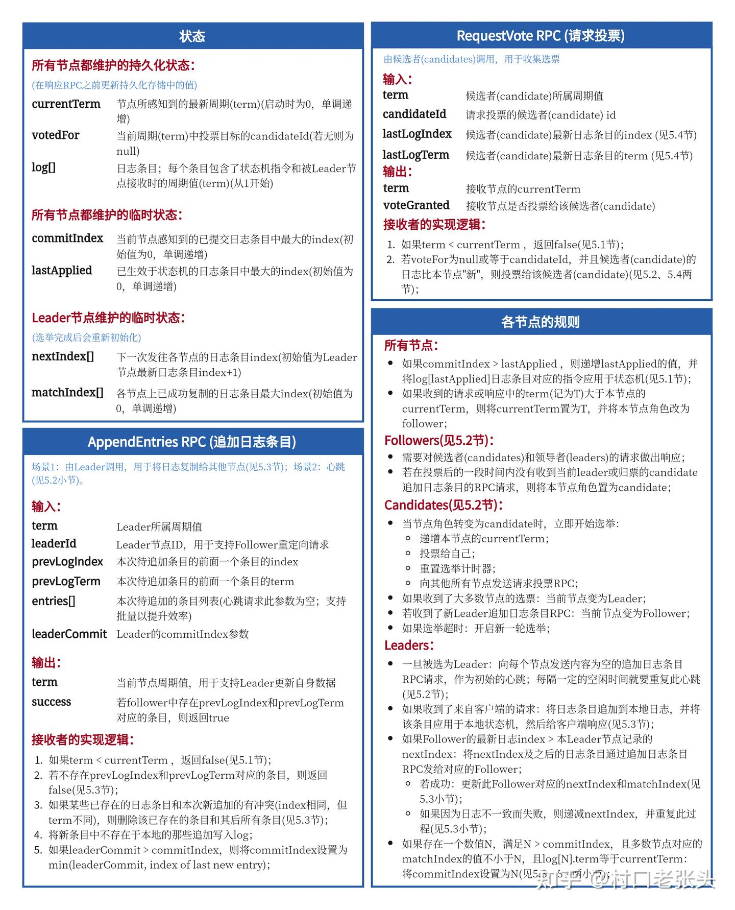

​	**Q：为什么leader只能提交当前任期的日志**

​	  A：[为什么leader只能提交当前任期的日志](https://zhuanlan.zhihu.com/p/369989974)

​	**Q：raft 算法中 leader 提交日志后，follower 只能通过 leader 心跳决定日志是否提交吗？**
​	A：不对。Leader 将日志复制到多数节点后标记为已提交并更新 commitIndex。Follower 主要通过 Leader 发送的 AppendEntries RPC 确定日志提交，该请求含新日志条目与 commitIndex，Follower 接收后更新自身 commitIndex 并应用日志。心跳主要用于维持 Leader 权威，虽也带 commitIndex，但 Follower 确定提交靠 AppendEntries RPC。

​	**Q：leader 不发起 AppendEntries RPC，follower 会落后一条日志吗？**
​	A：不一定。若 Leader 不发 AppendEntries RPC，可能因故障或网络问题，Follower 无法及时接收新日志，会逐渐落后，且可能不止落后一条。若 Follower 自身有问题，也会导致日志同步延迟。不过 Raft 有容错和恢复机制，如 Leader 恢复后会补发日志，Follower 发现不一致会请求缺失日志

